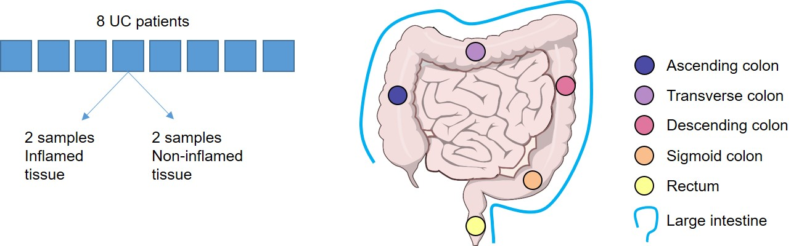

```{r setup, include=FALSE}
knitr::opts_chunk$set(echo = FALSE)
knitr::opts_chunk$set(comment = NA)
```

```{css, echo= FALSE}
/* Custom CSS to allow plots to scale */
figure {
    max-width: 100%;
    overflow: visible;
}

pre {
    border: none !important;
    background-color: transparent !important;
    padding: 0 !important;
    margin: 0 !important;
}  
```
## Introduction  

`All code associated to this page can be found `[`here`](https://github.com/svalbuenaa/UlcerativeColitisBulkRNAseq)  

*Ulcerative colitis (UC)* is one of the two main forms of *Inflammatory bowel disease*, a chronic inflammatory condition where the colon and rectum become inflamed. UC is characterized by the presence of small ulcers  in the lining of the colon´s lining, as well as a variety of [symptoms](https://www.nhs.uk/conditions/ulcerative-colitis/), including abdominal pain, diarrhea, or weight loss.  

As a disease associated with immune cell responses, UC is characterized by a complex de-regulation of innate and adaptive immune cell activity, that includes as main features the overactivation of neutrophils and a Th2-like profile (e.g. see [here](https://www.mdpi.com/2077-0383/11/2/400)).  

Whereas an important corpus of data has been collected about the pathology of UC immune responses, key questions, such as the interaction between the gut microbiota and the immune cells, or whether dysfunctions in the epithelial barrier are a cause or a consequence of altered immune responses, remain unanswered.  

Transcriptomic analyses of single cells or whole pieces of tissue have helped to clarify these questions (e.g. see [here](https://academic.oup.com/ibdjournal/article/27/1/94/5823961) or [here](https://www.gastrojournal.org/article/S0016-5085(20)30658-2/fulltext)). Interestingly, most of these analyses use samples from healthy people as controls, comparing their transcriptomic signatures with those obtained from inflamed tissue in UC patients. However, less attention has been given to alternative study designs, such as using non-inflamed tissue from the same UC patients as a control for the gene expression in inflamed tissue. These alternative approaches might offer potential advantages, for example allowing the evaluation of the relative abundance of specific immune cell types or the evaluation of expression changes in genes related to the integrity of the epithelial barrier. 

In this work, I explore these potential advantages by analyzing a bulk-RNAseq performed over non-inflamed as well as inflamed samples obtained from UC patients. The RNAseq was performed by the group of William Gordon and the counts can be found in the Gene Expression Omnibus Series [GSE107593](https://www.ncbi.nlm.nih.gov/geo/query/acc.cgi?acc=GSE107593).


```{r message=FALSE, warning=FALSE}
if (!require("ggplot2")) install.packages("ggplot2")
if (!require("stringr")) install.packages("stringr")
if (!require("ggrepel")) install.packages("ggrepel")
if (!require("dplyr")) install.packages("dplyr")
if (!require("tidyr")) install.packages("tidyr")
if (!require("patchwork")) install.packages("patchwork")
if (!require("BiocManager")) install.packages("BiocManager")
if (!require("ggbreak")) install.packages("ggbreak")
if (!require("ggvenn")) install.packages("ggvenn")

if (!require("clusterProfiler")) BiocManager::install("clusterProfiler")
if (!require("AnnotationDbi")) BiocManager::install("AnnotationDbi")
if (!require("org.Hs.eg.db")) BiocManager::install("org.Hs.eg.db")
if (!require("org.Hs.eg.db")) BiocManager::install("DESeq2")
if (!require("ComplexHeatmap")) BiocManager::install("ComplexHeatmap")


library(ggplot2)
library(stringr)
library(ggrepel)
library(dplyr)
library(tidyr)
library(patchwork)
library(clusterProfiler)
library(AnnotationDbi)
library(org.Hs.eg.db)
library(DESeq2)
library(plotly)
library(ggbreak) 
library(ComplexHeatmap)
library(circlize)
```

```{r}
CoV_mean <- function(arg_exp){
  # Calculates Coefficient of variation and mean expression per gene for a given gene expression dataframe 
  mean_values_ <- rowMeans(arg_exp) # Calculate mean
  CoV_values_ <- apply(arg_exp, 1, function(row) sd(row) / mean(row)) # Calculate coefficient of variation
  stats_Experiment <- cbind(mean_values_, CoV_values_) # Put together for return
  colnames(stats_Experiment) <- c("Mean_expression",
                                  "CoV") 
  return(as.data.frame(stats_Experiment)) 
}
```

```{r}
plot_CoV_mean <- function(arg_dataframe, arg_x, arg_y,
                          arg_lab_title = "title", arg_lab_x = "x", arg_lab_y = "y",
                          arg_color = "blue"){
  # Plots the mean expression vs the coefficient of variation (calculated elsewhere, e.g. with the function above) for a gene expression dataset
  ggplot(arg_dataframe, aes_string(x = arg_x, y = arg_y, label=c("Gene"))) +
    geom_point(color = arg_color, alpha = 0.4) +
    labs(x = arg_lab_x, y = arg_lab_y, title = arg_lab_title)+
    theme_light()+
    theme(plot.title = element_text(size = 12, hjust=0.5))+
    xlim(2.5, 15)+
    ylim(-0.01, 0.5)
}
```

```{r, include=FALSE}
# Set a file path
project_dir <- file.path("Z:", "My Drive", "Bioinformatics project bulk-RNAseq")
```

```{r, include=FALSE}
# Import dataset with gene counts
genes_list <- read.delim(file.path(project_dir, "GSE107593_raw_reads_BCHRNAseq.txt"), check.names=F)
genes_list
```

### Raw counts matrix {.unlisted .unnumbered}

This is the count matrix with the relevant information. It includes **gene symbols and names** (columns 1 and 2) as well as the **corresponding expression in the 48 samples** (columns 3 and subsequent)

```{r}
colnames(genes_list) <- c("ENSG_symbol", colnames(genes_list[2:length(colnames(genes_list))]))
genes_list[,c(1,3,10:ncol(genes_list))]
```


### Study design (samples and individuals) {.unlisted .unnumbered}

For each individual, 4 samples were obtained, 2 of them from an inflamed area and 2 from a non-inflamed area. Each sample was obtained at one out of 6 possible areas: 4 in the colon (ascending, descending, sigmoid or transverse), the rectum, or the whole large intestine.  




### Patient IDs  {.unlisted .unnumbered}
```{r}
# Read GSE107593_series_matrix.txt
metadata_matrix <- read.delim(file.path(project_dir, "Dataset copy, untouched", "GSE107593_series_matrix.txt"), check.names=F, skip = 25)
metadata_matrix_2 <- data.frame(t(metadata_matrix[,2:ncol(metadata_matrix)]))
colnames(metadata_matrix_2) <- metadata_matrix[,1]

# Obtain patient ids
patient_ids <- unique(str_replace(metadata_matrix_2[,12], "subject: ",""))

for (el in patient_ids){
  cat(paste0(el,"\n"))
}
```

### Area from which samples were obtained {.unlisted .unnumbered}
```{r}
# Obtain sampling locations
location <- unique(str_replace(metadata_matrix_2[,11], "location: ",""))

for (el in sort(location)){
  cat(paste0(el,"\n"))
}
```


## Lognormalization of counts {.unlisted .unnumbered}

```{r include=FALSE}
# Create df for normalization:
genes_list_lognorm <- data.frame(matrix(NA, nrow = nrow(genes_list), ncol = ncol(genes_list)))

# Columns before counts
for (col in 1:9){
  genes_list_lognorm[[col]] <- genes_list[[col]]
}

# Column names
colnames(genes_list_lognorm) <- colnames(genes_list)

for (i in 10:ncol(genes_list)) {
  genes_list_lognorm[, i] <- log2((genes_list[, i] / colSums(genes_list[i]) * 1000000)+8)
}

genes_list_lognorm[,c(1,3,10:ncol(genes_list))]
```

### Most variable genes
#### Mean vs CoV for all genes {.unlisted .unnumbered}
```{r, warning=FALSE}
df_mean_vs_CoV <- genes_list_lognorm[,10:ncol(genes_list)]
stats_ <- CoV_mean(df_mean_vs_CoV)
stats_$ENSG <- genes_list_lognorm[[1]]
stats_$Gene <- genes_list_lognorm[[3]]
p1 <- plot_CoV_mean(stats_, arg_x = "Mean_expression", arg_y = "CoV", arg_lab_title = "Mean vs CoV, all samples", arg_lab_x = "Mean expression across samples", arg_lab_y = "Coefficient of Variation")

p1
```

## Mean vs CoV for most variable genes {.unlisted .unnumbered}
```{r}
most_variable_genes <- (stats_ %>% arrange(desc(CoV)))[1:500,]
p2 <- plot_CoV_mean(most_variable_genes, arg_x = "Mean_expression", arg_y = "CoV", arg_lab_title = "Mean vs CoV, all samples, 500 most variable genes", arg_lab_x = "Mean expression across samples", arg_lab_y = "Coefficient of Variation")

p1plotly <- ggplotly(p2)
p1plotly
```


# Principal component analysis (PCA)

## PCA with all genes

### Scree plot {.unlisted .unnumbered}
```{r out.width="100%"}
# Create dataframe for PCA of lognormalized samples
genes_list_lognorm_for_pca <- t(genes_list_lognorm[,10:ncol(genes_list_lognorm)])
colnames(genes_list_lognorm_for_pca) <- rownames(genes_list_lognorm)

# PCA of lognorm counts
pca_lognorm <- prcomp(genes_list_lognorm_for_pca)

# Screeplot
pca_lognorm_metrics <- as.data.frame(t(summary(pca_lognorm)$importance))
colnames(pca_lognorm_metrics) <- c("Standard_deviation", "Proportion_of_Variance", "Cumulative_Proportion")
pca_lognorm_metrics$PCs <- as.numeric(substr(rownames(pca_lognorm_metrics), 3, length(rownames(pca_lognorm_metrics))))

ggplot(data = pca_lognorm_metrics[1:10,], aes(x=PCs, y=Proportion_of_Variance)) +
  geom_line(color="blue") +
  geom_point() +
  scale_x_continuous(breaks = c(1:10)) +
  labs(title="PCA of lognormalized counts - Variance explained per principal component")+
  xlab("Principal component")+
  ylab("Proportion of variance explained")+
  theme_light()+
  theme(plot.title = element_text(size=12),
        axis.title.x = element_text(size = 11),
        axis.title.y = element_text(size = 11),
        text = element_text(size=11),
        aspect.ratio = 1/1.5)
```

```{r}
# Create dataframe to contain relevant metadata in appropriate format
df_samples_treatments <- data.frame(row.names = rownames(metadata_matrix_2))

# Get sample name and inflammation status
df_samples_treatments$sample_inflamation <- ""
for (row in (1:nrow(metadata_matrix_2))){
  df_samples_treatments[row, ncol(df_samples_treatments)] <- str_split(
    rownames(df_samples_treatments)[row],
    "Ulcerative colitis Colon Biopsy ",
    simplify = T)[2]}

# Get sample name
df_samples_treatments$sample <- ""
for (row in (1:nrow(df_samples_treatments))){
  df_samples_treatments[row, ncol(df_samples_treatments)] <- gsub(" [^ ]*$", "", df_samples_treatments[row, ncol(df_samples_treatments)-1])
}

# Get inflammation status
df_samples_treatments$inflammation <- ""
for (row in (1:nrow(df_samples_treatments))){
  df_samples_treatments[row, ncol(df_samples_treatments)] <- gsub(".* ", "", df_samples_treatments[row, ncol(df_samples_treatments)-2])
}

# Get sample location
df_samples_treatments$location <- ""
for (row in (1:nrow(df_samples_treatments))){
  df_samples_treatments[row, "location"] <- gsub("location: ", "", metadata_matrix_2[row, 11])
}

# Get sampling hospital
df_samples_treatments$hospital <- ""
for (row in (1:nrow(df_samples_treatments))){
  df_samples_treatments[row, "hospital"] <- gsub("site: ", "", metadata_matrix_2[row, 10])
}

# Create pca scores dataframe for lognormalized counts pca
pca_scores_lognorm <- data.frame(pca_lognorm$x[,1:10])
pca_scores_lognorm$patient <- ""

for (row in (1:nrow(pca_scores_lognorm))){
  for (id_patient in 1:length(patient_ids)){
    if(!is.na(str_extract(rownames(pca_scores_lognorm[row,]), patient_ids[id_patient]))){
      pca_scores_lognorm[row, ncol(pca_scores_lognorm)] <- str_extract(rownames(pca_scores_lognorm[row,]), patient_ids[id_patient])
    }
  }
}

# Get the sample id in the PCA scores dataframe
pca_scores_lognorm$sample <- rownames(pca_scores_lognorm)

# Get the inflammation status of each sample
pca_scores_lognorm$inflammation <- ""
for(row_scores in 1:nrow(pca_scores_lognorm)){
  for(row_df in 1:nrow(df_samples_treatments)){
    if(pca_scores_lognorm[row_scores, "sample"] == df_samples_treatments[row_df, "sample"]){
      pca_scores_lognorm[row_scores, "inflammation"] <- df_samples_treatments[row_df, "inflammation"]
    }
  }
}

# Get the sample location in the PCA scores dataframe
pca_scores_lognorm$location <- ""
for(row_scores in 1:nrow(pca_scores_lognorm)){
  for(row_df in 1:nrow(df_samples_treatments)){
    if(pca_scores_lognorm[row_scores, "sample"] == df_samples_treatments[row_df, "sample"]){
      pca_scores_lognorm[row_scores, "location"] <- df_samples_treatments[row_df, "location"]
    }
  }
}

# Get the sampling hospital in the PCA scores dataframe
pca_scores_lognorm$hospital <- ""
for(row_scores in 1:nrow(pca_scores_lognorm)){
  for(row_df in 1:nrow(df_samples_treatments)){
    if(pca_scores_lognorm[row_scores, "sample"] == df_samples_treatments[row_df, "sample"]){
      pca_scores_lognorm[row_scores, "hospital"] <- df_samples_treatments[row_df, "hospital"]
    }
  }
}
```

```{r}
colData <- pca_scores_lognorm[,c(11, 13:15)]
colData$inflammation <- factor(colData$inflammation, levels = c("Non-Inflamed", "Inflamed"))
colData$location <- factor(colData$location)
colData$hospital <- factor(colData$hospital)

colData
```

### PCA Scores {.unlisted .unnumbered}
```{r out.width="100%"}
p1 <- ggplot(pca_scores_lognorm, aes(x=PC1, y=PC2, colour = inflammation)) +
  geom_point(size=2)+
  labs(title = "Inflammation status")+
  theme_light()+
  theme(legend.position = "bottom",
        plot.title = element_text(hjust = 0.5),
        aspect.ratio = 1)+
  guides(colour=guide_legend(ncol=1))

p2 <- ggplot(pca_scores_lognorm, aes(x=PC1, y=PC2, colour = location)) +
  geom_point(size=2)+
  labs(title = "Sample location")+
  theme_light()+
  theme(legend.position = "bottom",
        plot.title = element_text(hjust = 0.5),
        aspect.ratio = 1)+
  guides(colour=guide_legend(ncol=2))

p1+p2+plot_annotation(title = "PCA scores according to sample metadata - inflammation status and sample location",
                      subtitle = "Counts log-normalized",
                      theme = theme(plot.title = element_text(hjust = 0.5, vjust = 3),
                                    plot.subtitle = element_text(hjust = 0.5, vjust = 3)))
```


```{r out.width="100%", warning=FALSE}
ggplot(pca_scores_lognorm, aes(x=PC1, y=PC2, colour = patient, shape = inflammation, label=patient)) +
  geom_point(size=3)+
  geom_text_repel(nudge_x = 2)+
  labs(title = "PCA scores by patient ID and inflammation status")+
  theme_light()+
  theme(plot.title = element_text(hjust=0.5))
```


## PCA with 500 most variable genes

```{r out.width="100%"}
# Create dataframe for PCA of lognormalized samples using 500 most variable genes
genes_list_lognorm_most_var_for_pca <- t((genes_list_lognorm %>% filter(ENSG_symbol %in% most_variable_genes$ENSG))[,10:ncol(genes_list_lognorm)])
colnames(genes_list_lognorm_most_var_for_pca) <- most_variable_genes$ENSG

# PCA of lognorm counts
pca_lognorm_most_var <- prcomp(genes_list_lognorm_most_var_for_pca)

pca_scores_lognorm_most_var_metrics <- data.frame(pca_lognorm_most_var$x[,1:10])
pca_scores_lognorm_most_var_metrics$patient <- pca_scores_lognorm$patient
pca_scores_lognorm_most_var_metrics$sample <- pca_scores_lognorm$sample
pca_scores_lognorm_most_var_metrics$inflammation <- pca_scores_lognorm$inflammation
pca_scores_lognorm_most_var_metrics$location <- pca_scores_lognorm$location
pca_scores_lognorm_most_var_metrics$hospital <- pca_scores_lognorm$hospital
```


### PCA Scores {.unlisted .unnumbered}
```{r out.width="100%"}
p1 <- ggplot(pca_scores_lognorm_most_var_metrics, aes(x=PC1, y=PC2, colour = inflammation)) +
  geom_point(size=2)+
  labs(title = "Inflammation status")+
  theme_light()+
  theme(legend.position = "bottom",
        plot.title = element_text(hjust = 0.5),
        aspect.ratio = 1)+
  guides(colour=guide_legend(ncol=1))

p2 <- ggplot(pca_scores_lognorm_most_var_metrics, aes(x=PC1, y=PC2, colour = location)) +
  geom_point(size=2)+
  labs(title = "Sample location")+
  theme_light()+
  theme(legend.position = "bottom",
        plot.title = element_text(hjust = 0.5),
        aspect.ratio = 1)+
  guides(colour=guide_legend(ncol=2))

p1+p2+plot_annotation(title = "PCA scores according to sample metadata - inflammation status and sample location",
                      subtitle = "Counts log-normalized, PCA over 500 Most variable genes",
                      theme = theme(plot.title = element_text(hjust = 0.5, vjust = 3),
                                    plot.subtitle = element_text(hjust = 0.5, vjust = 3)))
```


```{r}
# Extract the rotations for pcas with lognormalized counts, all genes
pca_rotations <- data.frame(pca_lognorm$rotation[,1:10])
pca_lognorm_rotations <- data.frame(pca_lognorm$rotation[,1:10])

# Add column with gene names to rotations dataframes
pca_rotations$gene_name <- genes_list$gene_name
pca_lognorm_rotations$gene_name <- genes_list$gene_name
```


# Differential expression analysis

```{r, include=FALSE}
cts <- as.matrix(genes_list[,c(10:ncol(genes_list))])
rownames(cts) <- genes_list[[3]]


cts <- cts[, rownames(colData)]

as.data.frame(cts)
```


```{r warning=FALSE}
dds <- suppressMessages(DESeqDataSetFromMatrix(countData = cts,
                              colData = colData,
                              design = ~ inflammation))
```

```{r}
smallestGroupSize <- 3
keep <- rowSums(counts(dds) >= 10) >= smallestGroupSize
dds <- dds[keep,]
```


```{r}
significance_level <- 0.001
```


```{r}
dds <- suppressMessages(DESeq(dds))
res <- results(dds, alpha = significance_level)
```


```{r}
gene_list <- as.data.frame(res)
gene_list$Gene <- rownames(gene_list)
gene_list %>% filter(padj<significance_level) %>% arrange(padj)
```


```{r}
plotMA(res)
```


```{r}
gene_list$significance <- NA
for (gene in 1:nrow(gene_list)){
  if (gene_list[gene,"log2FoldChange"]>=1 & gene_list[gene,"padj"]< significance_level){
    gene_list[gene, "significance"] <- "Up"
  }  
  
  else if (gene_list[gene,"log2FoldChange"]<=(-1) & gene_list[gene,"padj"]< significance_level){
    gene_list[gene, "significance"] <- "Down"
  } 
  
  else if (abs(gene_list[gene,"log2FoldChange"])<1 | gene_list[gene,"padj"]>= significance_level){
    gene_list[gene, "significance"] <- "Not significant"
  }
}

gene_list_sig_up_outlier <- gene_list %>% filter(log2FoldChange > 20)
```


```{r, message=FALSE, warning=FALSE, echo=FALSE}
p1 <- suppressMessages(ggplot(gene_list%>%filter(log2FoldChange<20), aes(x=log2FoldChange, y=-log10(padj), label=Gene, color=significance))+ 
  geom_point(size=0.8) + 
  xlim(-12, 12)+ 
  scale_x_continuous(breaks=seq(-10, 10, 5), expand = expansion(mult = c(0, 0.001))) + 
  annotate("text", x = -10, y = -5, label = "-10") + 
  annotate("text", x = 10, y = -5, label = "10") + 
  ylim(0,62)+ 
  theme_light()+ 
  theme(
        panel.border = element_blank())+ 
  geom_vline(xintercept = -10, size=0.15)+ 
  geom_hline(yintercept=0, size=0.15)+ 
  geom_vline(xintercept=1, size=0.1, linetype = "dashed")+ 
  geom_vline(xintercept=(-1), size=0.1, linetype = "dashed")+ 
  geom_hline(yintercept=-log10(significance_level), size=0.1, linetype = "dashed")+ 
  scale_color_manual(values = c("Up"="#b02428", "Not significant"="grey", "Down"="#6697ea"))+ 
  labs(color = "Significance"))

p2 <- suppressMessages(ggplot(gene_list_sig_up_outlier, aes(x=log2FoldChange, y=-log10(padj), label=Gene)) + 
  geom_point(size=0.8, color="#b02428") + 
  xlim(19, 31) + 
  scale_x_continuous(breaks=c(20, 25, 30), expand = expansion(mult = c(0.01, 0.01))) + 
  ylim(0,62) + 
  theme_light() + 
  annotate("text", x = 30, y = -5, label = "30") + 
  annotate("text", x = 20, y = -5, label = "20") + 
  theme(panel.border = element_blank(), 
        axis.title.x = element_blank(),
        axis.title.y = element_blank(), 
        axis.text.y = element_blank(), )+ 
  geom_vline(xintercept = 30, size=0.15)+ 
  geom_hline(yintercept=0, size=0.1)+ 
  geom_hline(yintercept=-log10(significance_level), size=0.05, linetype = "dashed")+ 
  geom_hline(yintercept=62, size=0.15))


p1plotly <- ggplotly(p1) %>% layout(height = 500)
p2plotly <- ggplotly(p2) 

subplot(p1plotly, p2plotly, widths = c(0.80, 0.20)) %>% 
  layout(margin=list(l=100, b=80),
    title = list(text = "DE analysis Not-Inflamed vs Inflamed samples", x = 0.2, y = 0.95),
    legend = list(y = 0.5, tracegroupgap = 0.5),
    annotations = list(
      list(
        x = 0.5, 
        y = -0.1, 
        xref = 'paper', 
        yref = 'paper', 
        showarrow = FALSE, 
        text = "log2FoldChange"
      ),
      list(
        x = -0.1, 
        y = 0.5, 
        xref = 'paper', 
        yref = 'paper', 
        showarrow = FALSE, 
        text = "-log10 p_adjusted",
        textangle = -90
      )
    )
  )
```


### GO enrichment up and down-regulated genes
```{r}
# Get upregulated genes
dge_up <- gene_list %>% filter(significance == "Up")

# Get downregulated genes
dge_down <- gene_list %>% filter(significance == "Down")
```

```{r include=FALSE}
GO_dge_up <- enrichGO(gene = dge_up$Gene, universe = gene_list$Gene, OrgDb = "org.Hs.eg.db", keyType = "SYMBOL", ont = "BP")

temp_GO_dge_up <- as.data.frame(GO_dge_up)[,c("ID", "Description", "GeneRatio", "p.adjust")]
temp_GO_dge_up$Description <- strtrim(temp_GO_dge_up$Description, 50)
rownames(temp_GO_dge_up) <- 1:nrow(temp_GO_dge_up)
temp_GO_dge_up
```


```{r, include=FALSE}
GO_dge_down <- enrichGO(gene = dge_down$Gene, universe = gene_list$Gene, OrgDb = "org.Hs.eg.db", keyType = "SYMBOL", ont = "BP")

temp_GO_dge_down <- as.data.frame(GO_dge_down)[,c("ID", "Description", "GeneRatio", "p.adjust")]
temp_GO_dge_down$Description <- strtrim(temp_GO_dge_down$Description, 50)
rownames(temp_GO_dge_down) <- 1:nrow(temp_GO_dge_down)
temp_GO_dge_down
```


```{r}
GO_dge_up_plot <-  as.data.frame(GO_dge_up)[,c("ID", "Description", "GeneRatio", "p.adjust")]
GO_dge_up_plot$Description <- strtrim(GO_dge_up_plot$Description, 48)
GO_dge_up_plot <- GO_dge_up_plot[1:10,]


GO_dge_down_plot <-  as.data.frame(GO_dge_down)[,c("ID", "Description", "GeneRatio", "p.adjust")]
GO_dge_down_plot <- GO_dge_down_plot[1:10,]
```


```{r, fig.width=7}
ggplot(GO_dge_up_plot, aes(x=(-log10(`p.adjust`)), y=reorder(Description, (-log10(`p.adjust`)))))+
  geom_col(fill="red", alpha=0.5)+
  geom_text(aes(x=6, y=reorder(Description, (-log10(`p.adjust`))), label = format(round((-log10(`p.adjust`)),digits=2), nsmall = 2)))+
  labs(title = "GO enrichment, upregulated genes", 
       y="",
       x="-log10(p-adjust)")+
  theme_minimal()
```


```{r, fig.width=7}
ggplot(GO_dge_down_plot, aes(x=(-log10(`p.adjust`)), y=reorder(Description, (-log10(`p.adjust`)))))+
  geom_col(fill="lightblue")+
  geom_text(aes(x=1, y=reorder(Description, (-log10(`p.adjust`))), label = format(round((-log10(`p.adjust`)),digits=2), nsmall = 2)))+
  labs(title = "GO enrichment, dowregulated genes", 
       y="",
       x="-log10(p-adjust)")+
  theme_minimal()
```


### Heatmap top 50 DEGs

**Based on p.adj**

```{r}
gene_list_heatmap <- gene_list %>% arrange(padj)
gene_list_heatmap <- gene_list_heatmap[1:50,]
gene_list_heatmap <- gene_list_heatmap %>% arrange(desc(log2FoldChange))
gene_list_heatmap[,c("baseMean", "log2FoldChange", "padj", "significance")]
```


Z-score norm

```{r, include=FALSE}
rld <- rlog(dds, blind=FALSE)
```


```{r, include=FALSE}
genes_list_heatmap_norm_all <- as.data.frame(assay(rld))
genes_list_heatmap_norm_all <- genes_list_heatmap_norm_all %>% filter(rownames(genes_list_heatmap_norm_all) %in% rownames(gene_list_heatmap))

genes_list_heatmap_norm_all <- genes_list_heatmap_norm_all[match(rownames(gene_list_heatmap), rownames(genes_list_heatmap_norm_all)), rownames(colData %>% arrange(inflammation) %>% select(inflammation))]

genes_list_heatmap_norm_all
```


```{r, include=FALSE}
mean_sd_non_inflamed_all <- as.data.frame(rowSds(as.matrix(genes_list_heatmap_norm_all), useNames = FALSE))
colnames(mean_sd_non_inflamed_all) <- "sd"
mean_sd_non_inflamed_all$mean <- rowMeans(as.matrix(genes_list_heatmap_norm_all))

genes_list_heatmap_norm_all <- (genes_list_heatmap_norm_all - mean_sd_non_inflamed_all$mean)/mean_sd_non_inflamed_all$sd

genes_list_heatmap_norm_all
```


```{r}
baseMean <- as.data.frame(gene_list_heatmap$baseMean)
colnames(baseMean) <- "Mean\nexpr."
rownames(baseMean) <- rownames(gene_list_heatmap)
```


```{r warning=FALSE, fig.height=16, fig.width=19}
col_padj <- colorRamp2(c(20,70), c("green", "magenta"))
col_FoldChange <- colorRamp2(c(-4,4), c("#27699C", "#DB8400"))
col_baseMean <- colorRamp2(c(0, (0.8*max(gene_list_heatmap$baseMean))), c("white", "brown"))

col_names <- colnames(genes_list_heatmap_norm_all)

# Define how to split them - first half as "Non-inflamed", second half as "Inflamed"
n_cols <- length(col_names)
half_point <- ceiling(n_cols / 2)

height <- 740

column_split <- factor(c(rep("Non-inflamed", half_point), rep("Inflamed", n_cols - half_point)),
                       levels = c("Non-inflamed", "Inflamed"))

h1 <- suppressMessages(Heatmap(genes_list_heatmap_norm_all,
                            row_order = rownames(genes_list_heatmap_norm_all),
                            column_order = colnames(genes_list_heatmap_norm_all),
                            name = "Z-score\nNorm.\nexpr.",
                            column_split=column_split,
                            width = unit(920, "points"),
                            height = unit(height, "points"),
                            column_names_gp = gpar(fontsize = 16),
                            column_title_gp = gpar(fontsize = 20),
                            heatmap_legend_param = list(
                              title_gp = gpar(fontsize = 14),
                              labels_gp = gpar(fontsize = 12),
                              grid_width = unit(0.7, "cm"))))

h2 <- suppressMessages(Heatmap(gene_list_heatmap$log2FoldChange,
                               col=col_FoldChange,
                               name="log2\nFoldChange",
                               column_names_gp = gpar(fontsize = 16),
                               cell_fun = function(j, i, x, y, w, h, col) {
                                  grid.text(as.matrix(format(round(gene_list_heatmap$log2FoldChange, 1), nsmall = 1))[i, j], x = x, y = y, 
                                    gp = gpar(fontsize = 16))},
                               width = unit(80, "point"),
                               height = unit(height, "point"),
                            heatmap_legend_param = list(
                              title_gp = gpar(fontsize = 14),
                              labels_gp = gpar(fontsize = 12),
                              grid_width = unit(0.7, "cm"))))


h3 <- suppressMessages(Heatmap((-log10(gene_list_heatmap$padj)),
                               col=col_padj,
                               name="-log10\n(padj)",
                               column_names_gp = gpar(fontsize = 16),
                               cell_fun = function(j, i, x, y, w, h, col) {
                                  grid.text(as.matrix(format(round(-log10(gene_list_heatmap$padj), 1), nsmall = 1))[i, j], x = x, y = y, 
                                    gp = gpar(fontsize = 16))},
                               width = unit(80, "point"),
                               height = unit(height, "point"),
                            heatmap_legend_param = list(
                              title_gp = gpar(fontsize = 14),
                              labels_gp = gpar(fontsize = 12),
                              grid_width = unit(0.7, "cm"))))

h4 <- suppressMessages(Heatmap(baseMean,
                               col=col_baseMean,
                               name = colnames(baseMean),
                               column_names_gp = gpar(fontsize = 16),
                               cell_fun = function(j, i, x, y, w, h, col) {
                                  grid.text(as.matrix(format(round(baseMean, 1), nsmall = 1))[i, j], x = x, y = y, 
                                    gp = gpar(fontsize = 16))},
                               row_names_side = "right",
                               width = unit(80, "point"),
                               height = unit(height, "point"),
                               row_names_gp = gpar(fontsize = 16),
                            heatmap_legend_param = list(
                              title_gp = gpar(fontsize = 14),
                              labels_gp = gpar(fontsize = 12),
                              grid_width = unit(0.7, "cm"))))


h_list <- h1+h2+h3+h4

draw(h_list, column_title="Top 50 DEG genes Non-inflamed vs inflamed", column_title_gp=gpar(fontsize =24))
```


```{r}
genes_list_norm <- as.data.frame(assay(rld))
genes_list_norm <- genes_list_norm[, rownames(as.data.frame(colData) %>% arrange(inflammation))]
t_genes_list_norm <- as.data.frame(t(genes_list_norm))
t_genes_list_norm$Inflammation <- c(rep("Non-inflamed", 24), rep("Inflamed", 24))
t_genes_list_norm$Inflammation <- relevel(as.factor(t_genes_list_norm$Inflammation), ref = "Non-inflamed")
```


### Plot single genes
```{r}
plotSingleGenes <- function(arg_gene){
  # Accepts the name of a gene and plots normalized expression for all samples separating Non-inflamed vs inflamed
  ggplot(t_genes_list_norm, aes(y=get(arg_gene), x = Inflammation, color=Inflammation))+
    geom_boxplot(outliers = FALSE)+
    geom_jitter(width=0.2, alpha=0.5, color="black")+
    scale_y_continuous(limits = c(0, 1.2*max(t_genes_list_norm[[arg_gene]])), expand = expansion(add = 0))+
    labs(title=arg_gene,
         x="Inflammation status",
         y="Normalized expression")+
    theme(plot.title = element_text(hjust = 0.5, size = 16),
          axis.text = element_text(size = 12),
          axis.title = element_text(size = 14),
          aspect.ratio = 1.5,
          panel.background = element_blank(),
          axis.line = element_line(linewidth = 0.5))
}

plot
```


```{r}
plotsSingleGenes <- list()
for(gene in rownames(gene_list_heatmap)){
  plotsSingleGenes[[gene]] <- plotSingleGenes(gene)
}
```


```{r fig.width=21}
wrap_plots(plotsSingleGenes[1:12])+ plot_layout(guides = "collect")
```


```{r}
plotSingleGenes("TGFB2")
```


# Imputing Immune Cell fractions

```{r, fig.height=10, fig.width=14}
color_scale_cibersortx <- c(
  "Neutrophils" = "black",
  "Eosinophils" = "#878b85",
  "Mast.cells.activated" = "#bec2bb",
  "Mast.cells.resting" = "#b8beb6",
  "Dendritic.cells.activated" = "#eeeeec",
  "Dendritic.cells.resting" = "#bd0000",
  "Macrophages.M2" = "#eb0000",
  "Macrophages.M1" = "#ff0000",
  "Macrophages.M0" = "#82427b",
  "Monocytes" = "#bd72a7",
  "NK.cells.activated" = "#163c89",
  "NK.cells.resting" = "#6399d1",
  "T.cells.gamma.delta" = "#00a810",
  "T.cells.regulatory..Tregs." = "#00e51f",
  "T.cells.follicular.helper" = "#1bf538",
  "T.cells.CD4.memory.activated" = "#d17d00",
  "T.cells.CD4.memory.resting" = "#f5be65",
  "T.cells.CD4.naive" = "#e75100",
  "T.cells.CD8" = "#ffb11a",
  "Plasma.cells" = "#cba600",
  "B.cells.memory" = "#f4d800",
  "B.cells.naive" = "#fcf53f"
)

imputed_cibersortx <- read.csv(file.path(project_dir, "CIBERSORTx_UC_Results.csv"))
imputed_cibersortx <- imputed_cibersortx[,1:(ncol(imputed_cibersortx)-3)]
rownames(imputed_cibersortx) <- imputed_cibersortx$Mixture
imputed_cibersortx <- imputed_cibersortx[(arrange(pca_scores_lognorm, desc(inflammation)) %>% select(sample))[[1]],]
colnames(imputed_cibersortx) <- c("Sample", colnames(imputed_cibersortx[2:ncol(imputed_cibersortx)]))
imputed_cibersortx$Inflammation <- as.data.frame(arrange(pca_scores_lognorm, desc(inflammation)) %>% select(inflammation))[rownames(imputed_cibersortx),1]
imputed_cibersortx$Inflammation <- factor(imputed_cibersortx$Inflammation, levels = c("Non-Inflamed", "Inflamed"))

imputed_cibersortx_long <- pivot_longer(imputed_cibersortx[,1:(ncol(imputed_cibersortx)-1)], cols = colnames(imputed_cibersortx[2:(ncol(imputed_cibersortx)-1)]), names_to = "Cell_Type", values_to = "Relative_Fraction")
imputed_cibersortx_long$Cell_Type <- factor(imputed_cibersortx_long$Cell_Type, levels = names(color_scale_cibersortx))
imputed_cibersortx_long$Sample <- factor(imputed_cibersortx_long$Sample, levels = (arrange(pca_scores_lognorm, desc(inflammation)) %>% select(sample))[[1]])


ggplot(imputed_cibersortx_long, aes(x = Sample, y = Relative_Fraction, fill = Cell_Type))+
  geom_bar(position="stack", stat="identity")+ 
  annotate(geom = "text", x=12, y=1.02, label="Non-Inflamed samples")+
  annotate(geom = "text", x=36, y=1.02, label="Inflamed samples")+
  annotate("segment", x = 0.5, xend = 24.4, y = 1.008, yend = 1.008, size = 0.75, color = "black") +
  annotate("segment", x = 24.6, xend = 48.5, y = 1.008, yend = 1.008, size = 0.75, color = "black") +
    annotate("segment", x = 0.5, xend = 24.4, y = -0.008, yend = -0.008, size = 0.15, color = "black") +
  annotate("segment", x = 24.6, xend = 48.5, y = -0.008, yend = -0.008, size = 0.15, color = "black") +
  annotate("segment", x = 0, xend = 0, y = 0, yend = 1, size = 0.05, color = "grey") +
  labs(title = "Imputed cell fractions",
       y = "Relative Fraction",
       fill = "Cell type")+
  scale_y_continuous(expand = c(0.01, 0))+
  scale_fill_manual(labels = str_replace_all(names(color_scale_cibersortx), "\\.", " "), values = color_scale_cibersortx)+
  guides(fill = guide_legend(ncol = 1))+
  theme_light()+
  theme(plot.title = element_text(hjust = 0.5),
        axis.text.x = element_text(angle = 90, vjust = 0.5, hjust=0),
        panel.grid.major = element_blank(),
        panel.border = element_blank())
```


### Plot single cell fractions
```{r}
plotImputedCellFractions <- function(arg_cellType){
  # Accepts the name of a cell type and plots its imputed value for all samples separating Non-inflamed vs inflamed
  ggplot(imputed_cibersortx, aes(y=get(arg_cellType), x = Inflammation, color=Inflammation))+
    geom_boxplot(outliers = FALSE)+
    geom_jitter(width=0.2, alpha=0.5, color="black")+
    scale_y_continuous(limits = c(0, 1.2*max(imputed_cibersortx[[arg_cellType]])), expand = expansion(add = 0))+
    labs(title=str_replace_all(arg_cellType, "\\.", " "),
         x="Inflammation status",
         y="Imputed cell fraction")+
    theme(plot.title = element_text(hjust = 0.5, size = 16),
          axis.text = element_text(size = 12),
          axis.title = element_text(size = 14),
          aspect.ratio = 1.5,
          panel.background = element_blank(),
          axis.line = element_line(linewidth = 0.5))
}
```


```{r}
plotsImputedCellFractions <- list()
for(cellType in names(color_scale_cibersortx)){
  plotsImputedCellFractions[[cellType]] <- plotImputedCellFractions(cellType)
}
```


```{r}
plotsImputedCellFractions[c("Neutrophils", "T.cells.CD4.memory.activated", "Dendritic.cells.activated", "Macrophages.M0")]
```

